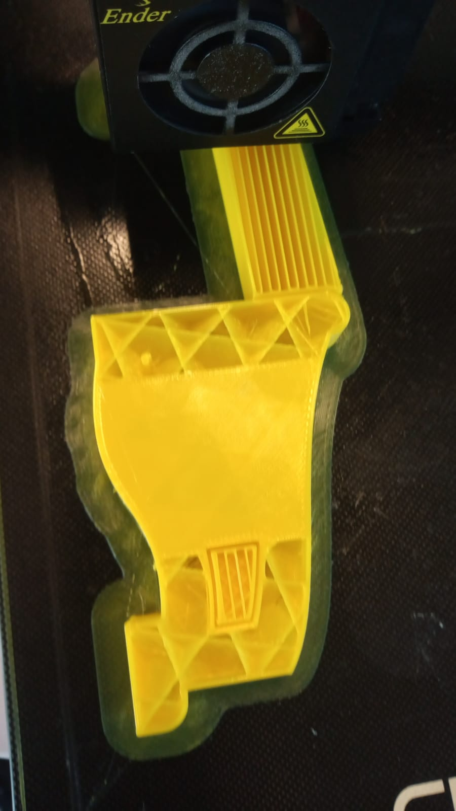
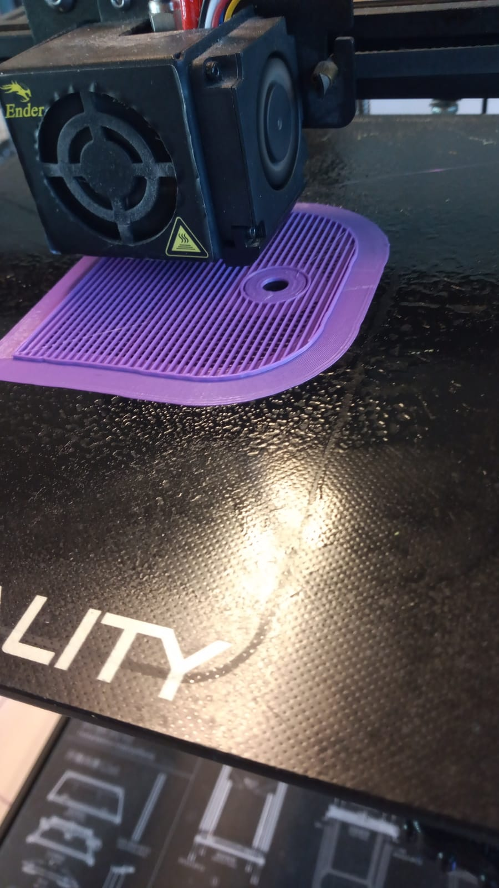
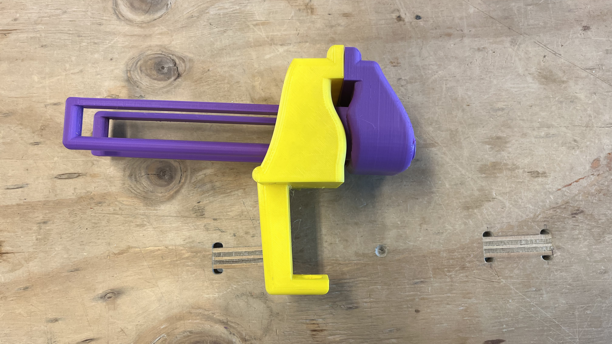

# Prensa de banco de escritorio
Este repositorio contiene el modelo y procedimiento para la fabricación de una prensa de banco de escritorio mediante impresión 3D. A continuación se presenta la descripción de ésta, como de sus componentes y requerimientos adicionales para su funcionamiento.

## Descripción (Español)
Prensa de banco escritorio para el trabajo ligero y/o sujeción de elementos livianos.

Esta consta de dos componentes modelados para impresión en 3D, correspondientes a una madíbula movil y una mandíbula fija. Adicionalmente, debido al esfuerzo necesario, se requiere la implementación de dos hilos y tres tuercas de igual paso.

La prensa tiene una longitud máxima de apertura de 120 mm. 

## Description (English)
Desk bench press for light work and/or fastening light items.

This consists of two components modeled for 3D printing, corresponding to a mobile jaw and a fixed jaw. Additionally, due to the necessary effort, the implementation of two threads and three nuts of equal pitch is required.

The bench press has a maximum opening length of 120mm.

## Documento CAD para impresión 3D
En el repositorio se presenta el archivo "Prensa_de_banco_de_escritorio.f3d" con los componentes destinados a la impresión en 3D.

## Especificaciones de impresión
A continuación se presentan las especificaciones de impresión con 10% de relleno.
+ Tiempo de impresión por componentes:
    + Mandíbula móvil: 10 horas
    + Mandíbula fija: 7 horas
+ Tiempo total de impresión (componentes por separado): 17 horas
+ Peso por componente:
    + Mandíbula móvil: 73.8 gramos
    + Mandíbula fija: 59.5 gramos
+ Peso total: 133.3 gramos

### Imágenes del proceso de impresión

Adicionalmente a estas imágenes, se presentan imágenes de los componentes por separado y finalizados en "Imagenes/Impresion"

## Ensamble de prensa
Debido a la facilidad de impresión de dos componentes, para su ensamble se ha de seguir el procedimiento a continuación:

1. Posicionamiento de la guía de la madíbula movil en la ranura de mandíbula fija, procurando que las zonas planas se encuentren de frente.
2. Posicionamiento de una de las tuercas en la ranura al interior de la madíbula fija, entre las guías de la mandíbula movil.
3. Ubicación del hilo a traves de los orificios paralelos a la guía (presentes en ambos componentes) y la tuerca instalada en el paso 2.
4. Ubicación de una tuerca en el hilo (posicionado en el paso 3) en tramo exterior de la mandíbula movil.
5. Posicionamiento de la tercera tuerca al interior de la ranura del brazo de la mandíbula fija junto con el segundo hilo.